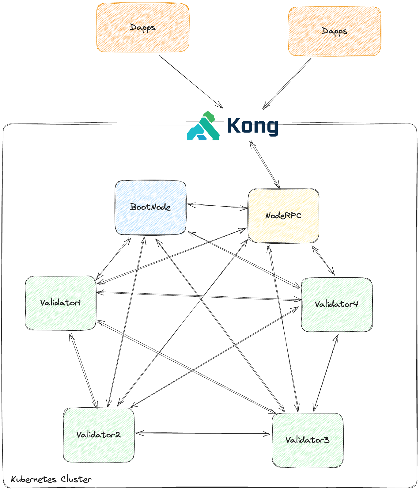

# Blockchain architecture

## Overview

<!-- Minimized the screen image by reducing its size -->

The blockchain architecture is composed of the following components:
- 1 bootnode
- 4 validator nodes
- 1 rpc node

For depoying the private ethereum network, we utilize the [besu open source project](https://besu.hyperledger.org/private-networks) as client executor and [QBFT](https://besu.hyperledger.org/private-networks/how-to/configure/consensus/qbft) as consensus algorithm.

**bootnode**:
- The bootnode is used to bootstrap the network. It is the first node to be started and it is responsible for discovering other nodes in the network.

**validator**:
- The validator nodes are used to validate the transactions and to participate in the consensus algorithm. For adding a new validator, you can contribute to the repository by adding a post hook installation job in the besu-node chart. This job will be executed at the end of the installation of the besu-node chart: retrieve the validator by contacting the configmap of the bootnode and execute the voting mechanism to add the new validator to the network. This must be excuted by the majority of the validator nodes otherwise the new validator will not be added to the network.

**rpc**:
- The rpc node is used to provide an interface to the blockchain. It is used by the users to interact with the blockchain. This node supports heavy load write and read operations. It's recommended to interconnect the dapps/indexer/explorer to this node RPC.
Also, since the blockchain grows in size, it's recommended to have a Kubernetes operator that will handle the volume expansion of the rpc node.

## Future work

Disaster recovery: The validator nodes are responsible for the consensus algorithm. If the validator nodes are down, the network will not be able to reach a consensus and the transactions will not be validated. It's recommended to have a backup plan to quickly recover the validator nodes. That why its important to have a snapshot of the blockchain at the end of each day.

Kong: It's an oss api gateway. Multiple external dapps/indexers/explorers will be connected to the kong instance to interact with the blockchain. What is interesing with kong is that you can have consumer. Each kong consumer will be attach to several kong plugins in order to limit the number of requests per second (rate limiting).

[[Back To README]](../README.md) [[Go To Setup]](./Setup-blockchain.md)

