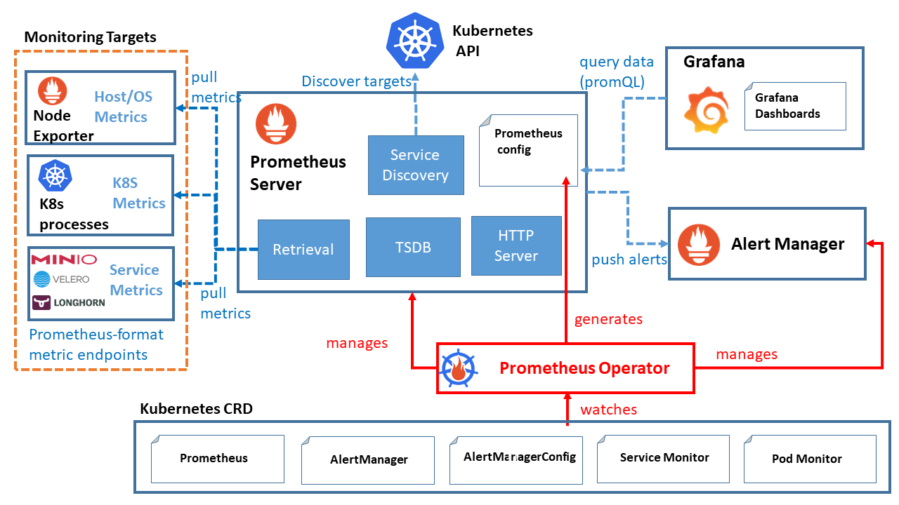
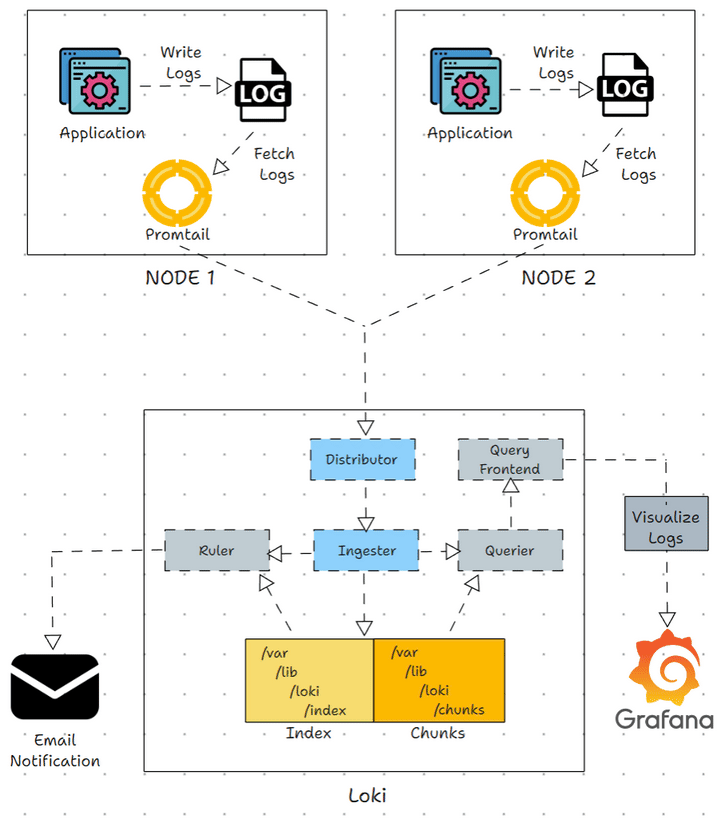

# Architecture

## Monitoring management

The monitoring architecture depicted integrates Prometheus, Grafana, and Kubernetes for a comprehensive monitoring system. Prometheus Server, managed by the Prometheus Operator, discovers and pulls metrics from various monitoring targets such as Node Exporter, Kubernetes processes, and service metrics endpoints. These metrics are stored in Prometheus's Time Series Database (TSDB) and served via its HTTP server. The Prometheus Operator oversees the configuration and management of Prometheus and Alert Manager instances, watching for changes in Kubernetes Custom Resource Definitions (CRDs). Alerts generated by Prometheus are routed through the Alert Manager. Grafana queries Prometheus for metrics data using PromQL and visualizes this data through customizable dashboards, providing real-time insights and monitoring capabilities. This setup ensures efficient metrics collection, storage, alerting, and visualization within a Kubernetes environment.

For future improvements, we could use a centralized monitoring platform like victoriametrics and use remote write to send the metrics to the victoriametrics instance. It would allow to have a more centralized and scalable solution.

## Logging Components

The loki stack is composed of two main components:
- Loki: a log aggregation system designed to store and query logs from multiple sources.
- Promtail: a log shipping agent that collects logs from the nodes and sends them to Loki.

The Promtail instance is deployed as a DaemonSet on each node to collect the logs and send them to the Loki instance. Loki can be deployed as a single instance or as multiple instances with different roles. 
[Different Modes](https://grafana.com/docs/loki/latest/get-started/deployment-modes/)

[[Back To README]](../README.md) [[Go To Setup]](./Setup-monitoring.md) 

